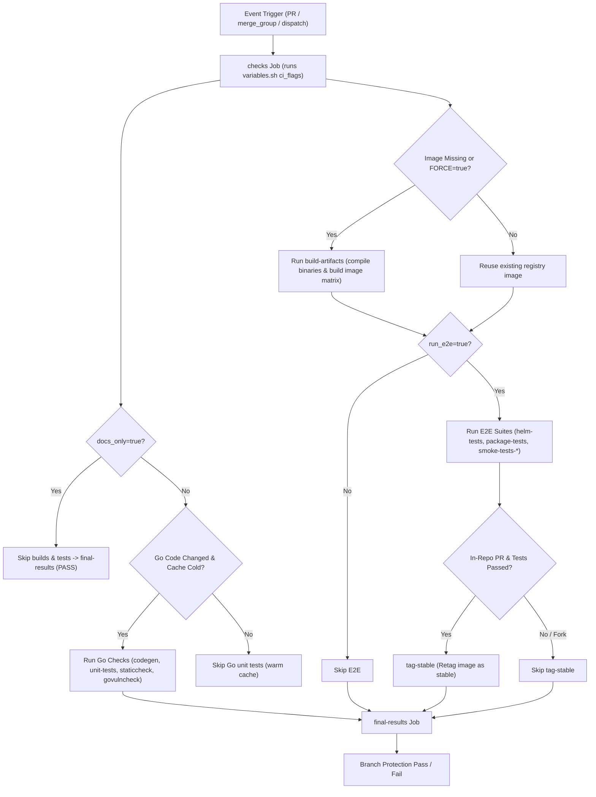

# CI Decision Logic & Workflow Gating Architecture

This document explains how the Continuous Integration (CI) decision logic and workflow gating operate in the NGINX Ingress Controller (NIC) repository, how the architecture evolved from the legacy approach, and how developers can inspect, test, and debug CI flows locally.

---

## Overview

The NIC CI pipeline (`.github/workflows/ci.yml`) validates pull requests, merge queue items (`merge_group`), release branches, and manual dispatches (`workflow_dispatch`).

To optimize developer feedback loops and conserve compute resources, the pipeline calculates **centralized decision flags** during the initial `checks` job. These flags determine which downstream stages (Go linting/unit tests, Docker container builds, e2e smoke/helm tests, and image retagging) should run or be safely skipped.

---

## The Old Way vs. The New Way

| Feature | The Legacy Approach | The New Architecture |
| --- | --- | --- |
| **Logic Location** | Scattered inline bash scripts & duplicated `if:` expressions inside `.github/workflows/ci.yml` | Centralized in pure bash functions inside [`.github/scripts/variables.sh`](.github/scripts/variables.sh) |
| **Gating Evaluation** | Ad-hoc per-job conditional expressions (`if: github.event_name == ... && steps.vars.outputs.docs_only != 'true'`) | Explicit key=value decision flags computed once in the `checks` job and passed as job outputs |
| **Local Testability** | Impossible without committing, pushing, and waiting for GitHub Actions | Instant local unit tests via [`.github/scripts/variables_test.sh`](.github/scripts/variables_test.sh) |
| **Dry-Run Previews** | Manual inspection of workflow YAML | Interactive scenario dry-runs via [`.github/scripts/ci-preview.sh`](.github/scripts/ci-preview.sh) |
| **Workflow Safety** | Unguarded jobs could run accidentally or fail silently | Mandatory repository gating checked by [`.github/scripts/validate-workflow-gating.sh`](.github/scripts/validate-workflow-gating.sh) |
| **Required Status Check** | Individual job checks configured in GitHub branch protection | Single `final-results` job that validates expected job outputs against computed flags |

---

## Centralized Decision Flags

During the `checks` job, `.github/scripts/variables.sh ci_flags` evaluates the following boolean flags and exports them to `$GITHUB_OUTPUT`:

| Flag | Purpose | Triggers / Gates |
| --- | --- | --- |
| `run_tests` | Overall master flag for whether testing is desired | `false` on docs-only changes, `RUN_TESTS_INPUT=false` opt-outs, or when stable image already exists in GCR. |
| `docker_build` | Gates container image compilation (`build-artifacts`) | `true` when non-docs changes occur and either stable or target build images are missing from registry (or `FORCE=true`). |
| `run_unit_tests` | Gates Go static analysis, codegen, and unit tests | `true` when non-docs code changes occur and Go binary cache is cold (`BINARY_CACHE_HIT!=true`), or on `FORKED=true` / `FORCE=true`. |
| `run_e2e` | Gates Helm, package, matrix, and smoke test suites | `true` whenever tests are requested (`run_tests=true`) or a container build is required (`docker_build=true`). |
| `tag_stable` | Gates retagging tested images as `stable` | `true` on in-repo non-docs builds when all e2e tests succeed (`FORKED=true` always returns `false`). |
| `promote` | Gates post-merge image promotion workflows | `true` on forced, tested runs on `main` or `release-*` branches. |

---

## CI Decision Flow



---

## Fast Paths & Optimization Logic

### 1. Docs-Only Fast Path (`docs_only=true`)
If a PR only touches documentation or repository metadata files (`*.md`, `docs/**`, `examples/**`, `site/**`, `.github/ISSUE_TEMPLATE/**`, `CHANGELOG`, `LICENSE`, `CODEOWNERS`), `get_docs_only()` returns `true`.
- **Result**: `docker_build`, `run_unit_tests`, `run_e2e`, and `tag_stable` are all set to `false`.
- **Impact**: Docs-only PRs finish in seconds without spinning up Docker image builds or Kubernetes test clusters.

### 2. Warm Binary Cache & Stable Image Fast Path
If a developer pushes a PR update where the Go codebase matches a previously built state (`BINARY_CACHE_HIT=true`) and the corresponding test image already exists in GCR (`STABLE_EXISTS=true`):
- **Result**: Unit tests and Docker builds are skipped.
- **Impact**: Avoids redundant rebuilds and re-tests of unchanged code paths.

### 3. External Fork PR Handling (`FORKED=true`)
Forked pull requests from external contributors do not have access to internal repository secrets or GCR push permissions:
- **Builds & Tests**: `FORKED=true` builds Docker images locally in the runner and executes unit and e2e/smoke/helm tests against those local builds (`run_e2e=true`).
- **Registry Operations**: Unauthenticated credentials (`Setup netrc`) and registry retagging (`tag_stable`) are automatically disabled (`tag_stable=false`).

---

## Single Required Status Check (`final-results`)

To simplify GitHub Branch Protection rules, the workflow defines a single required job named `final-results`:

1. **Dependency Collection**: `final-results` depends on all upstream jobs (`needs: [checks, verify-codegen, unit-tests, build-artifacts, setup-matrix, tag-target, helm-tests, package-tests, smoke-tests-*, tag-stable]`).
2. **Flag Enforcement**: Rather than treating skipped jobs as failures, `final-results` compares actual job outcomes (`success`, `skipped`, `failure`) against the expected decision flags:
   - If `run_unit_tests=true`, then `unit-tests`, `verify-codegen`, `staticcheck`, and `govulncheck` MUST be `success`.
   - If `docker_build=true`, then `build-artifacts` MUST be `success`.
   - If `run_e2e=true`, then `setup-matrix`, `helm-tests`, `package-tests`, `smoke-tests-*`, and `tag-target` MUST be `success`.
3. **False-Green Protection**: If an upstream job's `if:` condition drifts from the central flag output and skips unexpectedly, `final-results` detects the discrepancy and fails the run.

---

## Developer Tooling & Local Debugging

Developers can test and preview CI logic locally without triggering remote GitHub Actions runs:

### 1. Dry-Run Scenario Preview (`ci-preview.sh`)
Inspect what flags and jobs will be executed for your current branch diff or a simulated scenario:

```bash
# Preview CI decisions for your current working directory diff vs main
./.github/scripts/ci-preview.sh

# Preview a simulated fork PR
FORKED=true ./.github/scripts/ci-preview.sh

# Preview a forced workflow dispatch run
FORCE=true ./.github/scripts/ci-preview.sh
```

### 2. Decision Logic Unit Tests (`variables_test.sh`)
Run the test suite that verifies all matrix decision combinations in `variables.sh`:

```bash
# Run decision unit tests
./.github/scripts/variables_test.sh

# Run with verbose output per test case
./.github/scripts/variables_test.sh -v
```

### 3. Workflow Gating Validation (`validate-workflow-gating.sh`)
Verify that all public workflow files in `.github/workflows/` have proper strict repository gating:

```bash
./.github/scripts/validate-workflow-gating.sh
```
