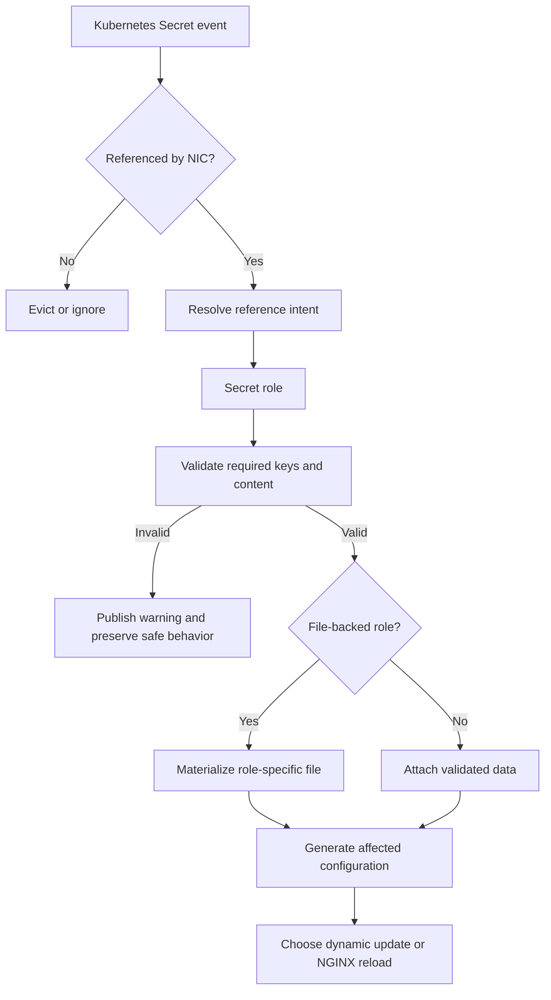

# High-Level Design: Type-Agnostic Kubernetes Secrets

> Status: Implemented
> Related work: [#10639](https://github.com/nginx/kubernetes-ingress/issues/10639), [#10816](https://github.com/nginx/kubernetes-ingress/pull/10816), [#10935](https://github.com/nginx/kubernetes-ingress/pull/10935)

## Overview

NGINX Ingress Controller (NIC) validates a referenced Kubernetes Secret according
to how the reference is used, not according to the Secret's `type` field. A
reference to a TLS certificate expects a certificate and private key, while a
reference to a trusted CA expects a CA certificate. The reference site provides
that intent explicitly.

This allows standard `Opaque` Secrets from cert-manager, External Secrets
Operator, Vault, and GitOps workflows to work without conversion. Existing
`kubernetes.io/tls`, `nginx.org/*`, and `nginx.com/*` Secrets remain supported.

The runtime change is implemented by PR #10816. PR #10935 updates the examples
to present `Opaque` as the default for non-TLS use cases while retaining typed
test fixtures for compatibility coverage.

## Goals

- Accept any Kubernetes Secret type when its data satisfies the referencing
  feature's contract.
- Preserve compatibility with every previously supported typed Secret.
- Fail closed when required keys are missing or their validated content is
  invalid.
- Allow one Secret to serve multiple purposes without file collisions.
- Preserve stable NGINX behavior during missing Secrets and invalid rotations.
- Avoid unnecessary storage, validation, and reload work for unrelated Secrets.
- Present `Opaque` Secrets consistently in user-facing examples.

## User Contract

A Secret's reference determines its role. The role defines the required keys,
content validation, materialization format, and reload behavior.

| Role | Required or recognized data | Recommended type | Legacy type |
| --- | --- | --- | --- |
| TLS | `tls.crt`, `tls.key` | `kubernetes.io/tls` or `Opaque` | `kubernetes.io/tls` |
| Trusted CA | `ca.crt`; optional `ca.crl` | `Opaque` | `nginx.org/ca` |
| JWT key | `jwk` | `Opaque` | `nginx.org/jwk` |
| Basic authentication | `htpasswd` | `Opaque` | `nginx.org/htpasswd` |
| OIDC client | `client-secret` | `Opaque` | `nginx.org/oidc` |
| API key clients | Client IDs as keys and credentials as values | `Opaque` | `nginx.org/apikey` |
| NGINX Plus license | `license.jwt` | `Opaque` | `nginx.com/license` |
| WAF bundle credentials | `token`, or `username` and `password`; optional `ca.crt` | `Opaque` | `nginx.com/waf-bundle` |

The recommended type is guidance, not an allowlist. NIC does not reject a
Secret because of its `type` value.

TLS Secrets remain recommended as `kubernetes.io/tls` because Kubernetes checks
for the standard certificate and key fields at admission time. Non-TLS examples
use `Opaque` to align with common Secret-producing tools.

## Architecture

### Intent-Driven Resolution

Intent flows from the referencing field to a Secret role. NIC never infers a
role by inspecting `Secret.type` or by looking for familiar keys. This avoids
ambiguous classification when a Secret contains data for several purposes, such
as a certificate pair and a CA bundle.

Resolved references are qualified by both the namespaced Secret name and the
role. The same Secret can therefore be used as, for example, both a server
certificate and a trusted CA.

### Reference-Gated Storage

The Secret informer observes all Secrets in watched namespaces, but NIC retains
and materializes only Secrets that are referenced by active resources or by
controller configuration.

At startup, informer contents temporarily prime the store so resources do not
observe existing Secrets as missing because of queue ordering. Normal
reconciliation then evicts unreferenced entries. A newly referenced Secret can
also be resolved on demand from the synchronized informer cache.

Validation results are cached per Secret and role. Updates revalidate only roles
that have already been resolved. Deletion removes every materialized role for
the Secret.

### Materialization

File-backed roles use distinct role-qualified filenames under `/etc/nginx/secrets`:
- TLS (`RoleTLS`): `ssl_keypair_<namespace>_<name>.pem`
- Trusted CA (`RoleCA`): `cert_bundle_<namespace>_<name>.crt` and `crl_bundle_<namespace>_<name>.pem`
- JWT key (`RoleJWK`): `jwt_key_<namespace>_<name>`
- Basic authentication (`RoleHtpasswd`): `basic_auth_<namespace>_<name>`

This prevents one Secret used in multiple roles from overwriting itself and removes ambiguity in file ownership. Non-file-backed roles (OIDC client secrets, API key mappings, WAF bundle credentials) are inlined directly into configuration or held in memory.

Expected paths remain available when a file-backed Secret is missing or invalid.
This preserves established Ingress behavior where affected requests fail at
runtime without producing an invalid NGINX directive that would reject the
entire configuration.

CA materialization tracks certificate and optional CRL paths separately. If a
role becomes invalid or a CRL is removed, obsolete files are removed rather than
left active.

## Reconciliation and Reload Behavior

Secret events are filtered by data changes. Metadata-only updates do not trigger
configuration work because labels, annotations, resource versions, and managed
fields do not affect generated NGINX configuration.

Policies are indexed by referenced Secret so a Secret event can find affected
Policies without scanning the full Policy cache. Resources using those Policies
are then reconciled through the normal controller pipeline.

Reload selection is based on the roles in which a Secret is currently resolved:

- A Secret used only for TLS certificates can use dynamic SSL reload when that
  feature is enabled.
- Any role whose data is read at configuration load time requires a full reload.
- A Secret used in several roles follows the strongest required reload action.

Special Secrets, including default and wildcard certificates, management TLS,
trusted CA, and license Secrets, are validated according to their configured
roles. A Secret can satisfy several special roles, and all required
representations are prepared before the associated reload succeeds. Invalid
rotations do not replace the previously active special Secret files.

## Security Model

Most roles fail closed through required-key and content validation. The API key
role is different because arbitrary data keys are client IDs, so it has no fixed
required key.

To reduce accidental authentication with an unrelated Secret, API key validation
uses a set of reserved keys. These are data-key names with established meaning
in another NIC role or a well-known Kubernetes Secret format, including
`tls.crt`, `tls.key`, `ca.crt`, `ca.crl`, `jwk`, `htpasswd`, `client-secret`,
`license.jwt`, `token`, `username`, `password`, `namespace`, `.dockercfg`, and
`.dockerconfigjson`.

Reserved keys are a misreference signal, not a client-ID denylist. NIC rejects
an API key Secret only when it contains at least two data entries and every key
is reserved. A Secret with fewer than two entries is not rejected by this
heuristic, and a multi-key Secret is accepted when at least one key is not
reserved. This preserves arbitrary client IDs, including a legitimate single
client named `token`, while rejecting recognizable shapes such as service
account, TLS, and basic-auth Secrets. Duplicate credential values are rejected,
and client IDs are checked before reaching NGINX configuration.

This is deliberate hardening rather than content-based role inference. The API
Key Policy reference remains the source of intent.

## Observability and Scale

Removing the type filter means every Secret type can produce informer events.
The design limits the resulting cost through:

- reference-gated retention and materialization;
- data-only update comparison;
- indexed Secret-to-Policy lookup; and
- lazy validation by role.

Secret telemetry counts distinct Secrets that have resolved successfully in at
least one role. It does not report every Secret observed by the informer. This
changes the meaning and expected value of the metric compared with the previous
type-filtered store count.

## Examples and Test Fixtures

User-facing examples follow these rules:

- Non-TLS Secret examples use `Opaque`.
- Certificate and key pair examples may remain `kubernetes.io/tls`.
- Documentation may mention legacy NIC types as compatible, but does not require
  them.

The secret generator can emit parallel typed and `Opaque` representations from
the same source material. Example symlinks target the `Opaque` representation,
while selected `tests/data` symlinks retain legacy typed representations. This
separation demonstrates the preferred workflow without losing upgrade and
backward-compatibility coverage.

## Compatibility and Upgrade Behavior

No CRD field, annotation, or Secret key name changes are required. Existing
working Secrets continue to work without recreation or type changes.

The visible upgrade effects are:

- References previously rejected only because of Secret type can become active.
- Wrong-type warnings are replaced by missing-key or content-validation errors.
- A previously ignored valid `Opaque` Secret may begin affecting traffic as
  intended.
- Secret telemetry changes from a type-filtered store count to a count of
  successfully resolved Secrets.

Role-specific files require no in-place migration. Controller pods generate
configuration and Secret files on fresh pod-local storage during startup, so old
and new pods can coexist during a rolling update.

## Verification

The implementation is covered by:

- role-based validation tests for valid, missing-key, invalid-content, arbitrary
  type, and legacy-type Secrets;
- API key negative tests for reserved Secret shapes and duplicate credentials;
- store tests for lazy resolution, update invalidation, multi-role cleanup, CRL
  removal, telemetry counting, and concurrent access;
- controller tests for reference gating, Policy indexing, special Secrets, and
  role-based reload selection;
- integration tests across TLS, mTLS, Basic Auth, JWT, OIDC, API Key, and special
  Secret workflows; and
- generator checks proving examples resolve to `Opaque` while selected test
  fixtures remain legacy typed.

The standard validation gates are `make test`, the controller race suite, lint,
and Secret generator regeneration checks.
