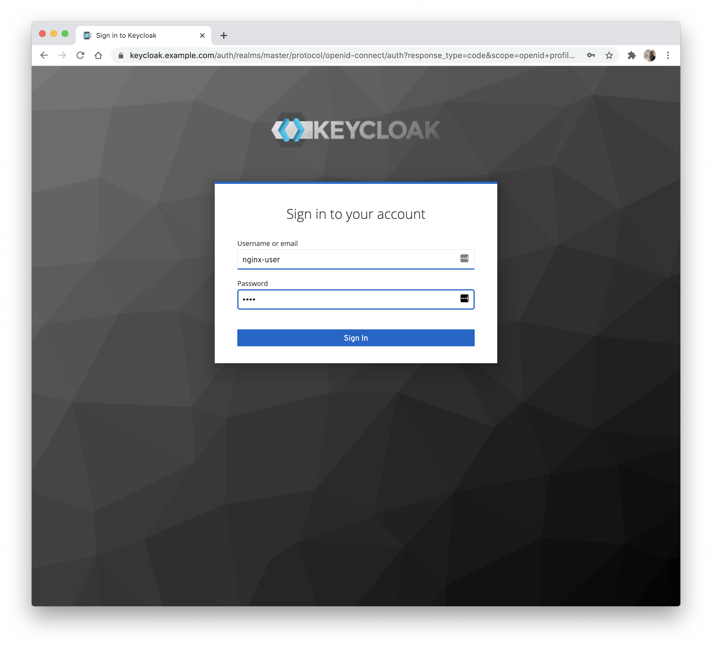
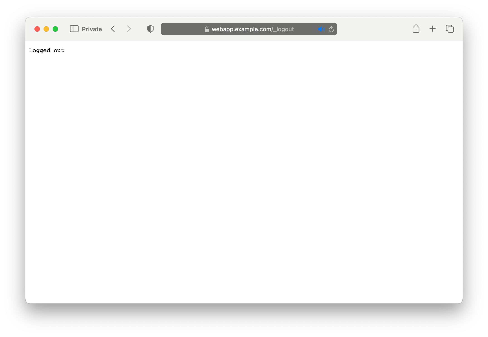

# OIDC Native

In this example we deploy a web application, load-balance it via a VirtualServer, and protect it using the NGINX Plus
native `ngx_http_oidc_module` and [Keycloak](https://www.keycloak.org/).

**Note**: The Keycloak container does not support IPv6 environments.

## Prerequisites

1. Run `make secrets` to generate the TLS secrets.
1. Follow the [installation](https://docs.nginx.com/nginx-ingress-controller/install/manifests) instructions to deploy
   NGINX Ingress Controller with `-enable-oidc`. The HTTPS port of the Ingress Controller must be `443`.
1. Get the external IP of the Ingress Controller service:

    ```shell
    kubectl get svc nginx-ingress -n nginx-ingress
    ```

## Step 1 - Rewrite the example manifests for your cluster

Substitute the placeholder `example.com` hostnames with `nip.io` names that resolve to your Ingress Controller IP:

```shell
LB_IP=$(kubectl get svc nginx-ingress -n nginx-ingress -o jsonpath='{.status.loadBalancer.ingress[0].ip}')
WEBAPP_HOST=webapp.${LB_IP}.nip.io
KEYCLOAK_HOST=keycloak.${LB_IP}.nip.io

sed -i.bak "s/webapp.example.com/${WEBAPP_HOST}/g; s/keycloak.example.com/${KEYCLOAK_HOST}/g" \
  keycloak.yaml virtual-server-idp.yaml virtual-server.yaml oidc-native-policy.yaml
```

The `.bak` files can be discarded once you've verified the substitutions.

## Step 2 - Deploy Keycloak and the Web Application

```shell
kubectl apply -f nginx-config.yaml
kubectl apply -f keycloak-tls-secret.yaml
kubectl apply -f keycloak.yaml
kubectl apply -f virtual-server-idp.yaml
kubectl apply -f webapp.yaml
kubectl apply -f tls-secret.yaml
```

[`nginx-config.yaml`](./nginx-config.yaml) sets the NGINX resolver to `kube-dns` so the OIDC module can resolve the
`nip.io` issuer hostname.

The shipped TLS secrets are self-signed and won't match your `nip.io` hostnames, so your browser will show a
certificate warning when you visit either page — accept it once per hostname. Backchannel (NGINX ↔ Keycloak) is not
affected because the policy sets `sslVerify: false`.

## Step 3 - Configure Keycloak

Open `https://${KEYCLOAK_HOST}` (accept the browser cert warning) and log in with `admin` / `admin`. Then follow
[`keycloak_setup.md`](./keycloak_setup.md) to create the `nginx-plus` client, but use these values:

- **Client authentication**: On
- **Valid redirect URIs**: `https://${WEBAPP_HOST}/*`
- **Valid post logout redirect URIs**: `https://${WEBAPP_HOST}/_logout`

Also create the `nginx-user` user with password `test`. Save the client secret shown on the Credentials tab.

## Step 4 - Deploy the Client Secret

Base64-encode the client secret you saved in Step 3:

```shell
echo -n "<client-secret-value>" | base64
```

Edit [`client-secret.yaml`](./client-secret.yaml), replacing `<insert-secret-here>` with the encoded value, then apply
it:

```shell
kubectl apply -f client-secret.yaml
```

## Step 5 - Deploy the OIDCNative Policy and VirtualServer

```shell
kubectl apply -f oidc-native-policy.yaml
kubectl apply -f virtual-server.yaml
```

## Step 6 - Test the Flow

1. Open `https://${WEBAPP_HOST}` in your browser (accept the cert warning). You are redirected to Keycloak.
1. Log in as `nginx-user` / `test`. 
1. You are redirected back to the web application.

## Step 7 - Log Out

1. Navigate to `https://${WEBAPP_HOST}/logout`. Your session is terminated and you land on `/_logout`. 
1. Visit `https://${WEBAPP_HOST}` again — you're prompted to log in.

## How it differs from the NJS OIDC example

| Feature | NJS OIDC (`spec.oidc`) | Native OIDC (`spec.oidcNative`) |
| ------- | ---------------------- | ------------------------------- |
| Implementation | JavaScript (njs) | Native C module |
| Endpoints | Explicit (auth, token, jwks) | Auto-discovered from issuer metadata |
| Session storage | Explicit keyval zones | Managed by the module |
| Multiple providers per VS | No | Yes (per route) |
| PKCE | Manual toggle | Configurable per policy |
| Callback URI | `/_codexch` | `/oidc_callback` (default) |
