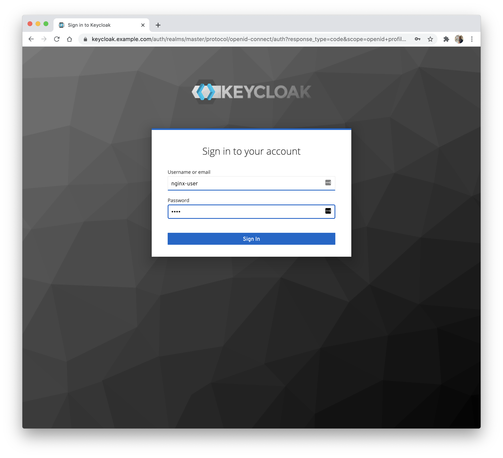
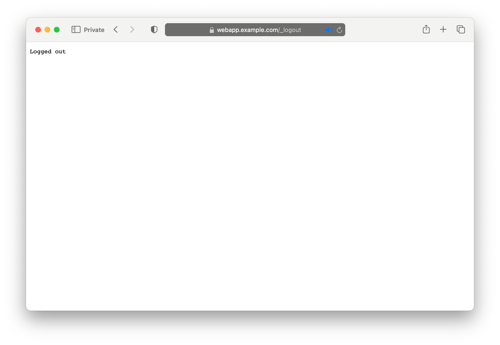

# OIDC Native

In this example, we deploy a web application, load-balance it via a VirtualServer, and protect it using the NGINX Plus native `ngx_http_oidc_module` (`oidcNative` policy) and [Keycloak](https://www.keycloak.org/).

**Note**: The Keycloak container does not support IPv6 environments.

## Prerequisites

1. Run `make secrets` to generate the TLS secrets for the example.
2. Follow the [installation](https://docs.nginx.com/nginx-ingress-controller/install/manifests) instructions to deploy NGINX Ingress Controller with `-enable-oidc`. The HTTPS port of the Ingress Controller must be `443`.
3. Get the external IP of the Ingress Controller service:

    ```shell
    kubectl get svc nginx-ingress -n nginx-ingress
    ```

## Step 1 - Configure Hostnames for Your Cluster

Get your Ingress Controller IP and set the hostname environment variables:

```shell
LB_IP=$(kubectl get svc nginx-ingress -n nginx-ingress -o jsonpath='{.status.loadBalancer.ingress[0].ip}')
export WEBAPP_HOST=webapp.${LB_IP}.nip.io
export KEYCLOAK_HOST=keycloak.${LB_IP}.nip.io
```

### Option A: Manual Replacement (Recommended)

In the example manifests, replace `webapp.example.com` with `${WEBAPP_HOST}` and `keycloak.example.com` with `${KEYCLOAK_HOST}`:

- `keycloak.yaml`
- `virtual-server-idp.yaml`
- `virtual-server.yaml`
- `oidc-native-policy.yaml`

### Option B: Automated Replacement Script

Run this command to rewrite the hostnames across all 4 files automatically:

```shell
sed -i.bak "s/webapp.example.com/${WEBAPP_HOST}/g; s/keycloak.example.com/${KEYCLOAK_HOST}/g" \
  keycloak.yaml virtual-server-idp.yaml virtual-server.yaml oidc-native-policy.yaml && rm -f *.bak
```

---

## Step 2 - Deploy TLS Secrets

Create the TLS secrets used for TLS termination of the web application and Keycloak:

```shell
kubectl apply -f tls-secret.yaml
kubectl apply -f keycloak-tls-secret.yaml
```

## Step 3 - Deploy Resolver ConfigMap

Apply the ConfigMap `nginx-config.yaml` to configure the NGINX DNS resolver so the native OIDC module can resolve the IdP issuer hostname:

```shell
kubectl apply -f nginx-config.yaml
```

## Step 4 - Deploy Keycloak and the Web Application

Create Keycloak, its VirtualServer, and the web application deployment:

```shell
kubectl apply -f keycloak.yaml
kubectl apply -f virtual-server-idp.yaml
kubectl apply -f webapp.yaml
```

The shipped TLS secrets are self-signed, so your browser will show a certificate warning when visiting either page - accept it once per hostname. Backchannel communication (NGINX ↔ Keycloak) is handled via `sslVerify: false` in the policy.

## Step 5 - Configure Keycloak

Configure the Keycloak realm, client, and test user. You can complete this step automatically via the Keycloak API or manually using the Web Admin Console:

### Option A: Automated API Setup (Recommended)

Follow [`keycloak_setup.md`](./keycloak_setup.md) to create the `nginx-plus` client and `nginx-user` account via `curl` commands.

### Option B: Manual Web Admin Console Setup

1. Navigate to the Keycloak Admin Console at `https://keycloak.<EXTERNAL-IP>.nip.io` (or `https://${KEYCLOAK_HOST}`), accept the self-signed TLS certificate warning, and sign in with **`admin` / `admin`**.
2. Create an OIDC client named `nginx-plus` with the following configuration:
   - **Client authentication**: On
   - **Valid redirect URIs**: `https://webapp.<EXTERNAL-IP>.nip.io/*` (or `https://${WEBAPP_HOST}/*`)
   - **Valid post logout redirect URIs**: `https://webapp.<EXTERNAL-IP>.nip.io/_logout` (or `https://${WEBAPP_HOST}/_logout`)
3. Create a test user named `nginx-user` with password `test`.
4. Copy the client secret from the **Credentials** tab for use in Step 6.

## Step 6 - Deploy the Client Secret

**Note**: If you're using PKCE, skip this step. PKCE clients do not have client secrets. Applying this will result in a broken deployment.

1. Encode the secret obtained in Step 5:

    ```shell
    echo -n $SECRET | base64
    ```

2. Edit `client-secret.yaml`, replacing `<insert-secret-here>` with the base64-encoded secret.

3. Deploy the secret:

    ```shell
    kubectl apply -f client-secret.yaml
    ```

## Step 7 - Deploy the OIDC Native Policy and VirtualServer

```shell
kubectl apply -f oidc-native-policy.yaml
kubectl apply -f virtual-server.yaml
```

## Step 8 - Test the Authentication Flow

1. Open `https://webapp.<EXTERNAL-IP>.nip.io` (or `https://${WEBAPP_HOST}`) in your browser. You are redirected to Keycloak.
2. Log in as `nginx-user` / `test`. 
3. You are redirected back to the web application.

## Step 9 - Log Out

1. Navigate to `https://webapp.<EXTERNAL-IP>.nip.io/logout` (or `https://${WEBAPP_HOST}/logout`). Your session is terminated and you land on `/_logout`. 
2. Visit `https://webapp.<EXTERNAL-IP>.nip.io` again — you are prompted to log in.

## How it Differs from the NJS OIDC Example

| Feature | NJS OIDC (`spec.oidc`) | Native OIDC (`spec.oidcNative`) |
| ------- | ---------------------- | ------------------------------- |
| Implementation | JavaScript (njs) | Native C module |
| Endpoints | Explicit (auth, token, jwks) | Auto-discovered from issuer metadata |
| Session storage | Explicit keyval zones | Managed by the module |
| Multiple providers per VS | No | Yes (per route) |
| PKCE | Manual toggle | Configurable per policy |
| Callback URI | `/_codexch` | `/oidc_callback` (default) |
