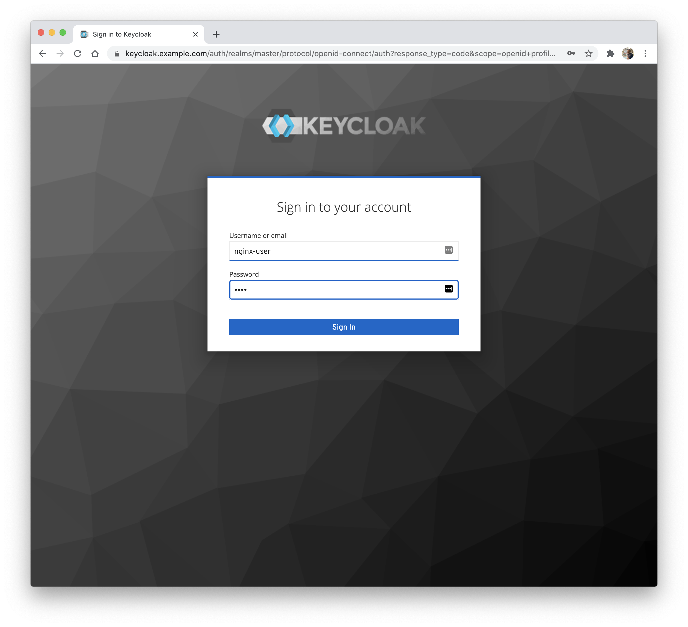
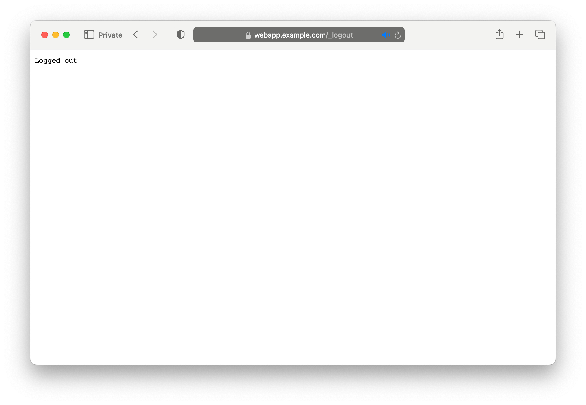

# OIDC

In this example, we deploy a web application, configure load balancing for it via a VirtualServer, and protect the
application using an OpenID Connect policy and [Keycloak](https://www.keycloak.org/).

**Note**: The KeyCloak container does not support IPv6 environments.

## Prerequisites

1. Follow the [installation](https://docs.nginx.com/nginx-ingress-controller/installation/installation-with-manifests/)
   instructions to deploy the Ingress Controller. This example requires that the HTTPS port of the Ingress Controller is
   `443`.
1. Save the public IP address of the Ingress Controller into `/etc/hosts` of your machine:

    ```text
    ...

    XXX.YYY.ZZZ.III webapp.example.com
    XXX.YYY.ZZZ.III keycloak.example.com
    ```

    Here `webapp.example.com` is the domain for the web application and `keycloak.example.com` is the domain for
    Keycloak.

## Step 1 - Deploy a TLS Secret

Create a secret with the TLS certificate and key that will be used for TLS termination of the web application and
Keycloak:

```console
kubectl apply -f tls-secret.yaml
```

## Step 2 - Deploy a Web Application

Create the application deployment and service:

```console
kubectl apply -f webapp.yaml
```

## Step 3 - Deploy Keycloak

1. Create the Keycloak deployment and service:

    ```console
    kubectl apply -f keycloak.yaml
    ```

1. Create a VirtualServer resource for Keycloak:

    ```console
    kubectl apply -f virtual-server-idp.yaml
    ```

## Step 4 - Configure Keycloak

To set up Keycloak:

1. Follow the steps in the "Configuring Keycloak" section of the documentation
   [here](https://docs.nginx.com/nginx/deployment-guides/single-sign-on/keycloak/#configuring-keycloak):
    1. To connect to Keycloak, use `https://keycloak.example.com`.
    1. Make sure to save the client secret for NGINX-Plus client to the `SECRET` shell variable:

        ```console
        SECRET=value
        ```

1. Alternatively, execute the commands [here](./keycloak_setup.md).

## Step 5 - Deploy the Client Secret

1. Encode the secret, obtained in the previous step:

    ```console
    echo -n $SECRET | base64
    ```

1. Edit `client-secret.yaml`, replacing `<insert-secret-here>` with the encoded secret.

1. Create a secret with the name `oidc-secret` that will be used by the OIDC policy:

    ```console
    kubectl apply -f client-secret.yaml
    ```

## Step 6 - Configure NGINX Plus Zone Synchronization and Resolver

In this step we configure:

- [Zone Synchronization](https://docs.nginx.com/nginx/admin-guide/high-availability/zone_sync/). For the OIDC feature to
  work when you have two or more replicas of the Ingress Controller, it is necessary to enable zone synchronization
  among the replicas.
- The resolver, so that an NGINX Plus can discover the other Ingress Controller replicas and resolve the Keycloak
  endpoint.

Steps:

1. Deploy a headless service for the Ingress Controller.

    ```console
    kubectl apply -f nginx-ingress-headless.yaml
    ```

1. Apply the ConfigMap `nginx-config.yaml`, which contains a stream snippet that enables zone synchronization and the resolver using the kube-dns service.

    ```console
    kubectl apply -f nginx-config.yaml
    ```

## Step 7 - Deploy the OIDC Policy

Create a policy with the name `oidc-policy` that references the secret from the previous step:

```console
kubectl apply -f oidc.yaml
```

## Step 8 - Configure Load Balancing

Create a VirtualServer resource for the web application:

```console
kubectl apply -f virtual-server.yaml
```

Note that the VirtualServer references the policy `oidc-policy` created in Step 6.

## Step 9 - Test the Configuration

1. Open a web browser and navigate to the URL of the web application: `https://webapp.example.com`. You will be
   redirected to Keycloak.
1. Log in with the username and password for the user you created in Keycloak, `nginx-user` and `test`.

1. Once logged in, you will be redirected to the web application and get a response from it. Notice the field `User ID`
in the response, this will match the ID for your user in Keycloak. 

## Step 10 - Log Out

1. To log out, navigate to `https://webapp.example.com/logout`. Your session will be terminated, and you will be
   redirected to the default post logout URI `https://webapp.example.com/_logout`.

1. To confirm that you have been logged out, navigate to `https://webapp.example.com`. You will be redirected to
   Keycloak to log in again.
